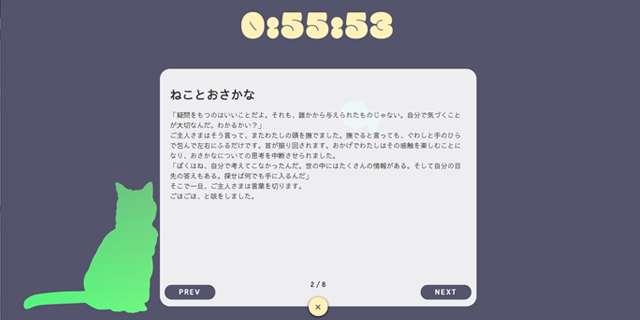

# svelte-tutorial-01


svelteを触ってみよう、という中で生まれた作品です。

テーマは「ねことおさかな」。

svelteの機能を盛り込みつつ、ちょっとした物語も添えていますので、ぜひ読んでいただければと思います。

（スマホサイズでもぜひぜひ(ﾐΦ ﻌ Φﾐ)ﾉ

サイトはこちら
https://svelte-tutorial-01.now.sh/

### 動かし方

```bash
npm i
```

```bash
npm run dev
```


